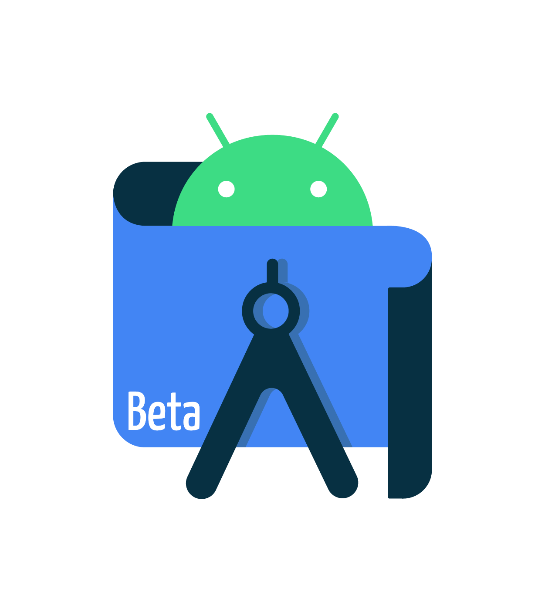

# Epoch ⏱
Beautiful Countdown timer app built to Demonstrate the Jetpack Compose UI with Animations *Made with love ❤️ by [Saie4047](https://github.com/Saie4047)*

<br />


<br />


<br />


## Epoch App Previews 👀
DISCONNECTED | CONNECTED
--- | --- |
 | 

<br />

## Built With 🛠
- [Kotlin](https://kotlinlang.org/) - First class and official programming language for Android development.
- [Jetpack Compose](https://developer.android.com/jetpack/compose) - Jetpack Compose is Android’s modern toolkit for building native UI.
- [Android Architecture Components](https://developer.android.com/topic/libraries/architecture) - Collection of libraries that help you design robust, testable, and maintainable apps.
  - [Jetpack Compose Navigation](https://developer.android.com/jetpack/compose/navigation) - Navigation refers to the interactions that allow users to navigate across, into, and back out from the different pieces of content within your app
- [Material Components for Android](https://github.com/material-components/material-components-android) - Modular and customizable Material Design UI components for Android.
- [Figma](https://figma.com/) - Figma is a vector graphics editor and prototyping tool which is primarily web-based.


<br />

## Build-tool 🧰
You need to have [Android Studio Beta 3 or above](https://developer.android.com/studio/preview) to build this project.
<br>


<br>

## Contribute 🤝
If you want to contribute to this app, you're always welcome!
See [Contributing Guidelines](https://github.com/Saie4047/Kotlin-Stop-watch/blob/main/CONTRIBUTING.md).

<br>


<br>


<br>

## Credits 🤗

- Icons are from [flaticon.com](https://tablericons.com)
- Heartly congratulations for Jetpack Compose Team who worked hard to make Compose great ♥️


<br />

## License 🔖

```
   Copyright 2021 Sai Jadhav

   Licensed under the Apache License, Version 2.0 (the "License");
   you may not use this file except in compliance with the License.
   You may obtain a copy of the License at

       https://www.apache.org/licenses/LICENSE-2.0

   Unless required by applicable law or agreed to in writing, software
   distributed under the License is distributed on an "AS IS" BASIS,
   WITHOUT WARRANTIES OR CONDITIONS OF ANY KIND, either express or implied.
   See the License for the specific language governing permissions and
   limitations under the License.

```

